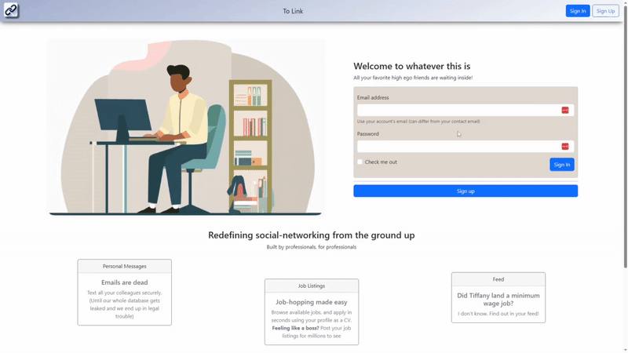
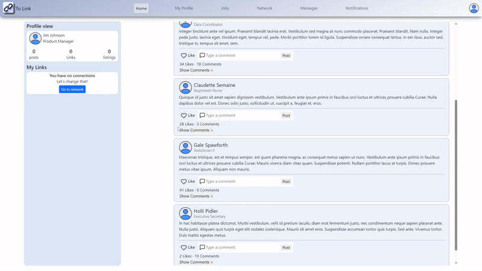
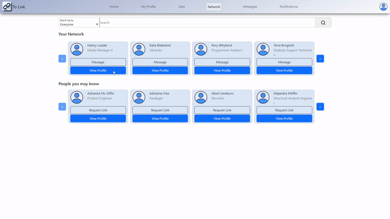
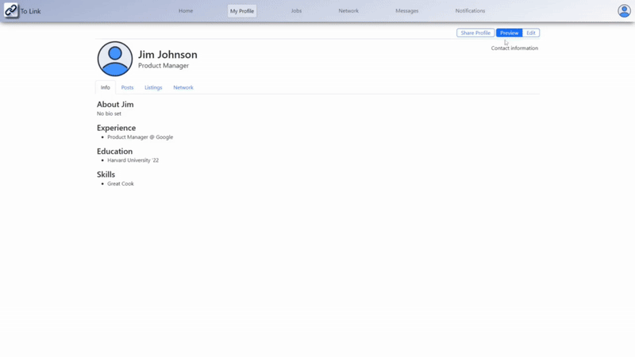

# ToLink - A LinkedIn Clone
**ToLink** is a fully functional web-based social networking platform prototype developed as part of the YS14 Internet Application Technologies course at NKUA. Below you can find execution information, design notes of our implementation, and a short feature presentation of our app.
## Development Team
- Dimitrios Stefanos Porichis ([LinkedIn](https://www.linkedin.com/in/dimitrios-stefanos-porichis/))
- Georgios Ragkos ([LinkedIn](https://www.linkedin.com/in/giorgos-ragkos-631194225/))


# Quick Start Guide

To run this application, you can use our `./run_app.sh` script located in the project's root directory for Linux Based Operating Systems.

If you don't happen to have a Linux OS installed, you can manually run the front end and backend of the app using the following instructions.

### For the backend

Our backend is implemented using **Django**, a high-level Python web framework. 

Run the commands below to install the required packages and initialize the database.

```
cd back-end
pip install -r "requirements.txt"
cd toLinkBack
python manage.py migrate
```
To add optional dummy data to the app, you can run:

```
python manage.py populate_data
```

Then you can run the server using:

```
python manage.py runserver
```

### For the frontend

Our frontend is written in **React** and is run using `npm` through Node.js. 

*Find relevant information on [how to get Node.js for your system](https://nodejs.org/en).*

Simply execute the following commands to fetch JS packages and run the frontend.

```
cd front-end
npm i
npm start
```

# Design and Implementation details

### Authentication
User authentication is enabled by [JWT Tokens](https://jwt.io/), an open, industry-standard RFC 7519 method for representing claims securely between two parties. The expiration times of the tokens have been elongated on purpose for demonstration purposes. ***This is not a production-level authentication configuration***.

### Recommendation system
A basic recommendation system using Matrix Factorization is in place. You can test it using the data population mechanism. Recommendations are based on the user's impression of posts and job listings.

### Figma Board
Check out our [Figma board](https://www.figma.com/design/W1lw9QQmLjScI4c6Y5NAwr/Wireframes?node-id=0-1&t=LMydUBQjvVj4GcvL-1) containing our low fidelity 
wireframes as well as our first schema drafts.

### Timeframe
ToLink was developed within a tight two-month timeframe. Our primary objective was to build a functional application prototype, which we successfully achieved.

# Discover To Link's features

### Signup
New users can create their accounts using the signup workflow.



### Feed, posts, likes and comments
Each user gets their personalized feed based on their network and interests, which are curated by our recommendation system.



### Create and Apply to Job Listings
Users can apply to job listings or publish their own either globally or within their network.


### Build your network and message colleagues
Users can create links with other users, expanding their network and communicating through Private Messages.



### Profile Customization

Profiles allow users to upload custom profile pictures, showcase their skills and experience, and configure privacy settings.



### Admin view and data export
Admin Users can moderate and extract user data through their admin dashboard view.


You can log in to the app using the following credentials to check the admin user functionalities.

```
email: admin@tolink.com
password: adminpassword123
```
`Note:` For the account to be present, you should perform the data population described in the *Quick Start Guide*

